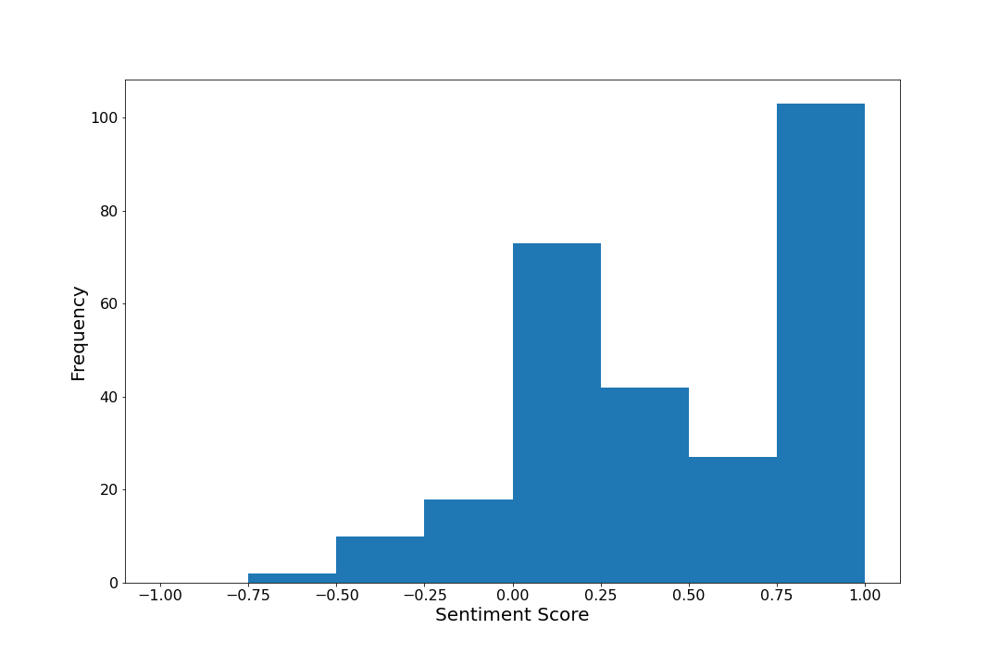
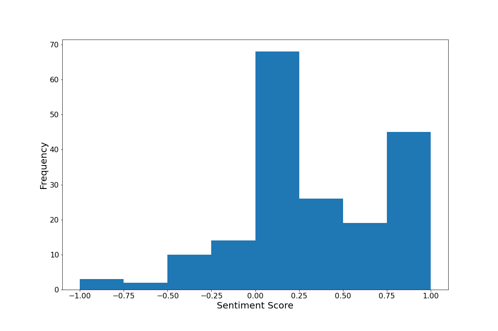
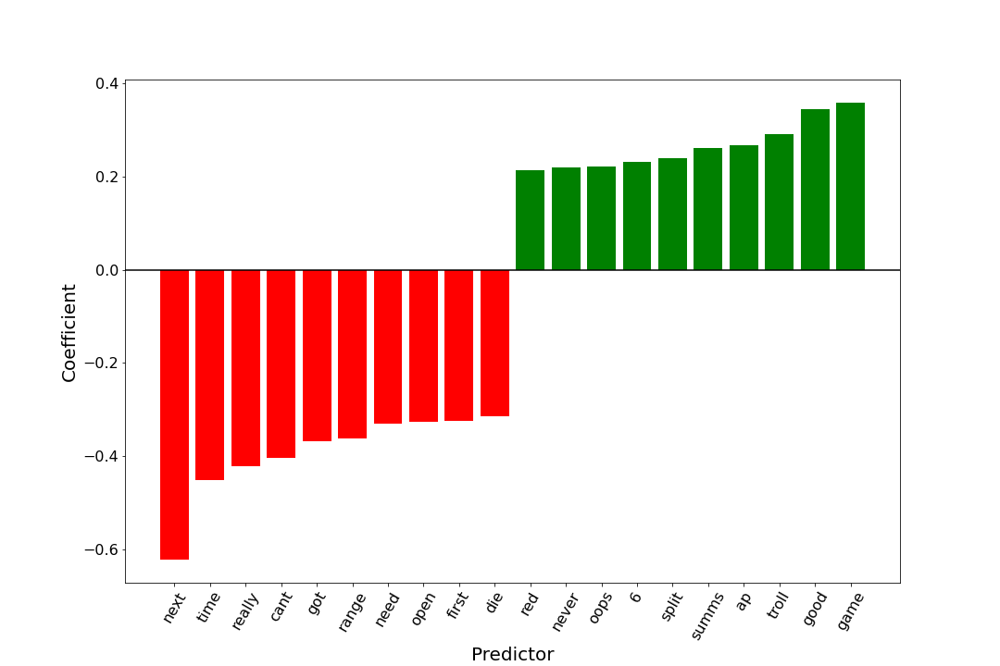

# Quantifying Tilt
Project to compare differences in behaviour when winning and losing online games.

## Summary
Contributor: Shawn Stankevitsch

Applied natural language processing techniques to a data set of my chat logs in League of Legends matches to quantify the impact of tilt and see if chat logs can be used as a predictor of match result.

Sentiment scores from the Google Cloud Natural Language API (-1 to 1 scale) were on average .145 points higher in wins than losses, a difference deemed statistically significant with p-value 0.000385.

Three models were trained on the data set: Linear SVM, Random Forest, and a Shallow Neural Network. The model that generalized best was the SVM, with a test set accuracy of 63.8%.

## Motivation
In competition, I am a strong believer that the impact of overall poor mental state (tilt) is underlooked. Thus, I strive to minimize the frequency and severity of tilt in my play. However I also recognize that tilt inevitably occurs from time to time due to in-game and external factors. This project looks to quantify tilt in my gameplay and see if patterns emerge from analyzing my behaviour. Behaviours may be difficult to quantify, however one way that tilt manifests is through in-game communications. Thus chat logs in won and lost matches will be run through sentiment analysis and fed into machine learning models to answer the following questions:
  1. Is there a difference in text sentiment between won and lost matches?  
  2. Can the outcome of a match be predicted from the messages sent?  

## Contents
Note: My own chat logs will not be uploaded as it contains personal conversations at times. However I have provided the data collection files used to allow for reproducibility. 
**DataPreparation.ipynb:** Notebook containing data collection and cleaning procedure.  
**Sentiment.ipynb:** Notebook containing sentiment analysis of chat logs.  
**SVM.ipynb:** Notebook containing SVM model training and evaluation, including feature importance calculations.  
**RandomForest.ipynb:** Notebook containing Random Forest model training and evaluation.  
**NeuralNetwork.ipynb:** Notebook containing Shallow Neural Network model training and evaluation.  

## Methodology
Chat logs for 530 League of Legends matches were obtained by requesting account data from Riot Games Support. It has since become more difficult to obtain chat data, as logs for only 100 matches can be requested every 30 days. 68 matches did not contain any messages and were excluded. Match results were obtained by querying the Riot Games API. 

For sentiment analysis, the Google Cloud Sentiment API was called with the overall match sentiment score being saved. Scores are returned on a scale from -1 (strong negative sentiment) to 1 (strong positive sentiment).

For machine learning, the bag of words model was used to represent the text data. This model was used over tf-idf as the latter will place heavy emphasis on champion names, which will occur multiple times in select matches (whenever said champions are in the match), but do not have any significance with regards to emotion/sentiment. Word embedding models were not used as the data set is small. Additionally, a seeded 75/25 split was used to validate and compare each model.

## Results/Analysis
### Sentiment  
To visualize the difference in sentiment between wins and losses, a histogram was created for sentiment scores in each case. Note that the sentiment score is a weighted average across the match, and thus neutral scores near 0 represent both low-emotion and mixed-emotion. 

*Fig 1: Sentiment Score Histogram for Wins*

*Fig 2: Sentiment Score Histogram for Losses*

Sentiment scores for wins and losses follow a bimodal distribution around neutral sentiment and strong positive sentiment. Upon manual inspection, the neutral peaks occur when most of my in-game communication consists of discussing match state (ex: enemy locations) and discussing strategy, both topics which are not usually emotionally charged. The strong positive peaks occur due to encouragements (ex: good job, nice) and salutations (ex: good game, good luck, have fun)

Two major differences can be seen when comparing the win and loss histograms. First, matches with strong negative sentiment only occur during losses. This confirms that tilt is playing a role in losses, and when I provide only negative comments (ex: telling teammates not to proceed a certain way, pointing out mistakes) I am almost certainly not leading towards a comeback victory.

The second difference is that matches with strong positive sentiment occur with a much larger frequency in wins than losses. As previously mentioned, many positive sentiment matches occur due to salutations, which occur at the beginning and end of the match. Although this may come as a result of the match result (I might be more likely to say good game at the end of a win), salutations do not have an impact on the match itself. Thus, to identify whether tilt is playing a role in the result, further analysis should be done to look into consecutive match (ex: win rate in the next match if "good game" is said or not).

To quantify the difference in sentiment and answer the first question in the motivation section, the sample means of sentiment score in wins and losses were calculated to be 0.4429 in wins and 0.2984 in losses. An unpaired t-test was performed with a null hypothesis of both samples having identical mean sentiment scores. The test returned a statistic of -3.581 with p-value 0.000385, and thus it is concluded that there is a statistically significant difference in sentiment between wins and losses.

### Machine Learning
**Support Vector Machine**  
A linear kernel was used for the SVM as after processing the input matrix was sparse and had more features than examples. Hyperparameter optimization was performed using grid search on C values from 2-5 to 215 and gamma values from 2-15 to 23. The best model achieved the following metrics:

| Metric         | Value  |
|----------------|--------|
| Train Accuracy | 74.3 % |
| Test Accuracy  | 63.8 % |
| F1-Score       | 0.62   |

One benefit of using a linear kernel is that the coefficients can be used to estimate feature importance. The predictors with the 10 highest and lowest magnitudes are plotted below:

*Fig 3: Strongest predictors of wins (green) and losses (red) for SVM*

The figure above confirms a suspicion from manual inspection, that I say "good game" significantly more during wins than losses. Another interesting point is that the word "next" is the strongest negative predictor (note: although "go next" is a common phrase used in League of Legends matches when someone wants to give up, the phrase was not used at the time of the matches in this data set). This means that pointing out mistakes provides little to no benefit to team morale even when phrased in a passive manner (ex: "I think you should do x/y/z next time").

**Random Forest**  
Initial training of the random forest classifier resulted in overfitting of the training set. To prevent this, hyperparameter optimization was performed with grid search on 26 to 210 estimator trees and 2 to 16 samples required to split. The best model achieved the following metrics:

| Metric         | Value  |
|----------------|--------|
| Train Accuracy | 73.6 % |
| Test Accuracy  | 59.5 % |
| F1-Score       | 0.59   |

The random forest classifier was still not as effective in generalizing to the test set, likely due to the sparsity and high dimensionality of the input data.

**Neural Network**  
As the data set is small, a large and/or deep neural network will overfit the training data. Thus a shallow neural network with a 50% dropout layer is used. Below is the summary of the neural network used to fit the data:

Model: "sequential"

| Layer (type)      | Output Shape | Param # |
|-------------------|--------------|---------|
| dense (Dense)     | (None, 16)   | 14624   |
| dropout (Dropout) | (None, 16)   | 0       |
| dense_1 (Dense)   | (None, 1)    | 17      |

Total params: 14,641  
Trainable params: 14,641  
Non-trainable params: 0  

The model achieved the following metrics:

| Metric         | Value  |
|----------------|--------|
| Train Accuracy | 81.8 % |
| Test Accuracy  | 61.7 % |
| F1-Score       | 0.61   |

This model generalized better than the random forest but worse than the linear SVM. The small sample size most likely played a factor in reducing the predictive power of the neural network.

**Conclusions**  
Overall, the best machine learning model was able to predict the outcome of new matches from chat logs with 63.8 % accuracy. As it is difficult to obtain additional chat data, one path to further analyze this data is to use the match timeline features of the Riot Games API, and see the impact of communications on match result in a more dynamic manner (ex: predicting comebacks victories and "throw" defeats)

Regardless, the predictive power of the models show that my communications (a reflection of my emotional state, attentiveness, and will to work with my team) play a significant role in my chances of winning or losing a match. Moving forward I would recommend all competitors looking to improve their ranking to take into account not only the negative impact of tilt but the positive impact of encouragement and informative communication.

